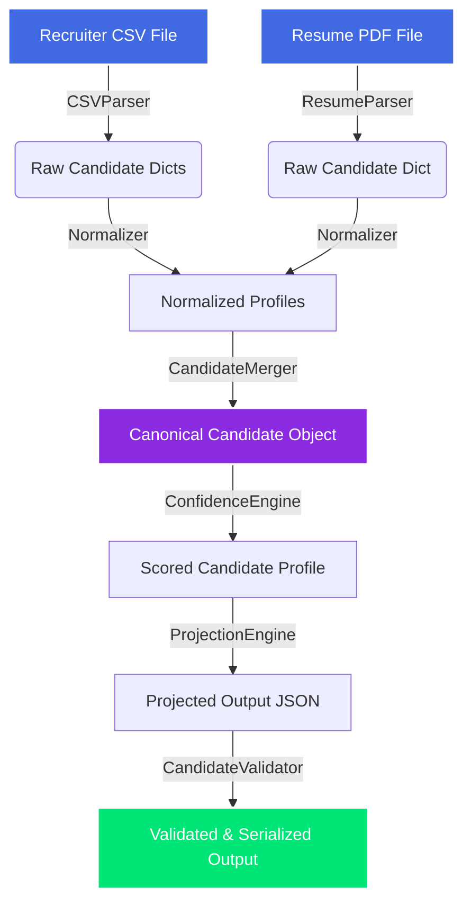

# Multi-Source Candidate Data Transformer & Ingestion Dashboard

A production-grade Python application built using Clean Architecture designed to ingest, parse, normalize, merge, score, and project candidate profile records from multiple raw sources (Recruiter CSV, Resume PDF, and notes).

The system includes a **premium dark-mode web UI dashboard** to upload files, configure dynamic output projections, run pipeline transforms, and audit data origins.

---

## 1. Pipeline Architecture & Flow
When documents are submitted, they flow through the following decoupled service stages:



### Core Services:
1. **Parsers (`app/parsers/`)**: Converts CSV sheets and PDF resume streams into structured Python dictionaries.
2. **Normalizer (`app/services/normalizer.py`)**: Sanitizes date formats (handles `"Present"` sentinels), canonicalizes skills, normalizes country codes to ISO alpha-2 (`pycountry`), and cleans phone numbers to E.164 formats (`phonenumbers`).
3. **Merger (`app/services/merger.py`)**: Resolves field conflicts using source confidences (CSV = `0.95`, Resume = `0.85`, Notes = `0.60`). Unions arrays and deeply merges overlapping nested objects like Experience items.
4. **Confidence Engine (`app/services/confidence.py`)**: Scores overall profile confidence as an average completeness metric across key fields.
5. **Projector (`app/services/projector.py`)**: Filters fields, renames target keys, and handles missing fields (`null` / `omit` / `error`) dynamically at runtime.
6. **Validator (`app/services/validator.py`)**: Enforces schemas, checks completeness of required fields, and guarantees serializability.

---

## 2. Directory Structure

```text
candidate-transformer/
├── app/
│   ├── main.py                 # FastAPI configuration & Static assets mount
│   ├── config.py               # Settings & environment configuration
│   ├── api/
│   │   └── routes.py           # HTTP endpoint definitions
│   ├── schemas/
│   │   ├── candidate.py        # Pydantic schema models for candidate profiles
│   │   └── projection.py       # Pydantic schemas for runtime config projections
│   ├── parsers/
│   │   ├── base_parser.py      # Abstract base parser class
│   │   ├── csv_parser.py       # Pandas-based CSV parser (dtype-safe)
│   │   └── resume_parser.py    # Regex & PDFPlumber-based resume text parser
│   ├── services/
│   │   ├── transformer.py      # CandidateTransformer orchestrator (business use case)
│   │   ├── normalizer.py       # Date, phone, country, and skill normalizer
│   │   ├── merger.py           # Conflict resolver & deep item list merger
│   │   ├── confidence.py       # Profile confidence scoring engine
│   │   ├── projector.py        # Dynamic field subsetting & path renamer
│   │   └── validator.py        # JSON schema and required fields validator
│   └── static/
│       ├── index.html          # Dashboard page markup
│       ├── style.css           # Glassmorphic dark mode styling
│       └── script.js           # Interactive controller (AJAX upload, circular gauge, audit trail)
└── tests/                      # Core test suites (fastapi client, unit tests)
```

---

## 3. Running the Project Locally

### Step 1: Clone & Setup Virtual Environment
Create and activate a python virtual environment, and install dependencies:
```bash
# Create environment
python -m venv venv

# Activate (PowerShell)
.\venv\Scripts\Activate.ps1

# Activate (CMD)
.\venv\Scripts\activate.bat

# Activate (Bash/Git Bash)
source venv/Scripts/activate

# Install requirements
pip install -r requirements.txt
```

### Step 2: Start the FastAPI Server
Start the Uvicorn web server locally:
```bash
uvicorn app.main:app --reload --host 0.0.0.0 --port 8000
```
- **Web UI Dashboard**: http://localhost:8000/
- **API Documentation**: http://localhost:8000/docs

---

## 4. How to Test the Project

### Execute the Test Suite
Ensure the virtual environment is activated and run:
```bash
python -m pytest
```
*This executes 26 tests covering parsers, normalization edge cases, conflict mergers, and endpoint integration routes.*

---

## 5. API Reference: POST `/api/v1/transform`

Transforms raw files using a dynamically provided runtime projection config.

### Request Format (`multipart/form-data`)
- **`csv_file`**: Upload file (CSV, optional).
- **`resume_file`**: Upload file (PDF, optional).
- **`config`**: String representation of Output Configuration JSON (optional).

### Example Config JSON:
```json
{
  "fields": [
    "full_name",
    "emails",
    {"path": "primary_phone", "from": "phones[0]"},
    "skills"
  ],
  "include_confidence": true,
  "include_provenance": true,
  "on_missing": "omit"
}
```

---

## 6. Cloud Deployment (Render)

This project contains a Docker configurations ready for cloud platforms like Render.

1. Create a **New Web Service** on Render and connect your Git repository.
2. Select **Docker** as the runtime environment.
3. Click **Deploy Web Service**. Render will automatically run the build and expose the application on port `8000`.
